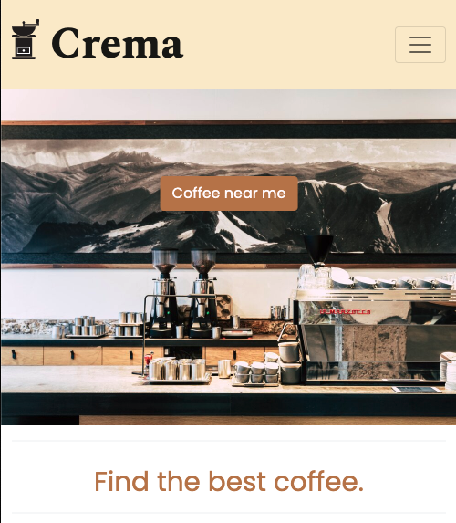
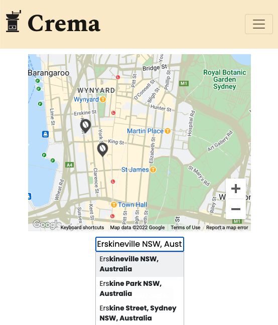
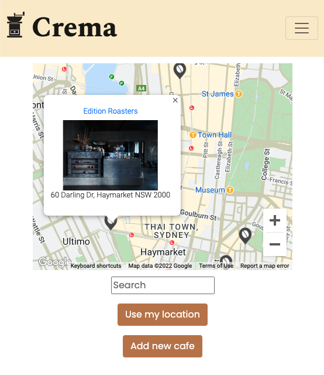
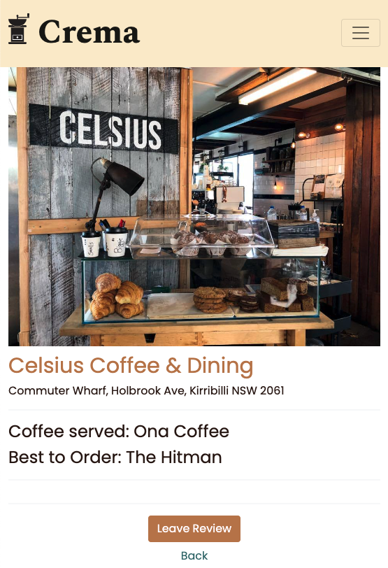

# Crema



[Crema](https://crema-7a519.web.app/) is a cafe search website utilizing Google Maps API.

## Technologies

- React
- Firebase Authentication
- Firestore
- Google Maps & Places API
- React-Bootstrap
- Sass
- Reach (Combobox)

---

# Introduction

This was the final solo project during my Software Engineering Immersive studies at General Assembly and was completed in roughly 8 days. For this project, I challenged myself to design a mobile first site using React and the Google Maps API. As a coffee lover, I wanted to build an homage to [Beanhunter](https://www.beanhunter.com/) that would help users find good coffee nearby.

Firebase was chosen for the backend since I wanted to primarily focus on frontend and mobile design. Additionally, I wanted to learn as much of the Google ecosystem as I could on this project including Firebase Authentication, Firestore, and the Google Maps API.

## Process

My first step was to set up Firebase and user authentication. The documentation for Firebase is very well kept and I found I could move rather quickly through this backend set up.

Next I moved on to the React app and focused on integrating the Google Maps API. I found the tutorials by Leigh Halliday and the Google Maps team to be incredibly useful. 

Once the map component was added, I set to link the map with my Firestore database so that cafes would display as custom marker. This proved to be the biggest challenge I encountered during this process and proved to be a wonderful study of async/await functions. To fully solve this problem I had to employ a ternary and map the cafes as markers once the state was set.

```javascript
{cafes.map((cafe) => (
    <Marker
    key={cafe.id}
    position={{
        lat: cafe.latitude,
        lng: cafe.longitude
    }}
    onClick = {() => {
        setSelected(cafe);
    }}
    icon = {{
        url: './coffeeicon.png',
        origin: new window.google.maps.Point(0, 0),
        anchor: new window.google.maps.Point(15, 15),
        scaledSize: new window.google.maps.Size(25, 30),
    }}
    />
))}
```

Following that, I introduced React-Bootstrap as the component library. This was used to assemble the responsive navbar and various forms.

---

# Feature List

- Google Map utilizing user location and Google Places search
- Cafe markers for Crema approved cafes
- Individual cafe pages generated from Firestore database
- Cafe creation form (in case your local spot is not already in Crema)
- User login & signup including Google sign in

## Screenshots




## Future Feature Add Ons

- Reviews - create, read, update, destroy
- Cafe ratings
- Limiting nearby location queries with Geohashing